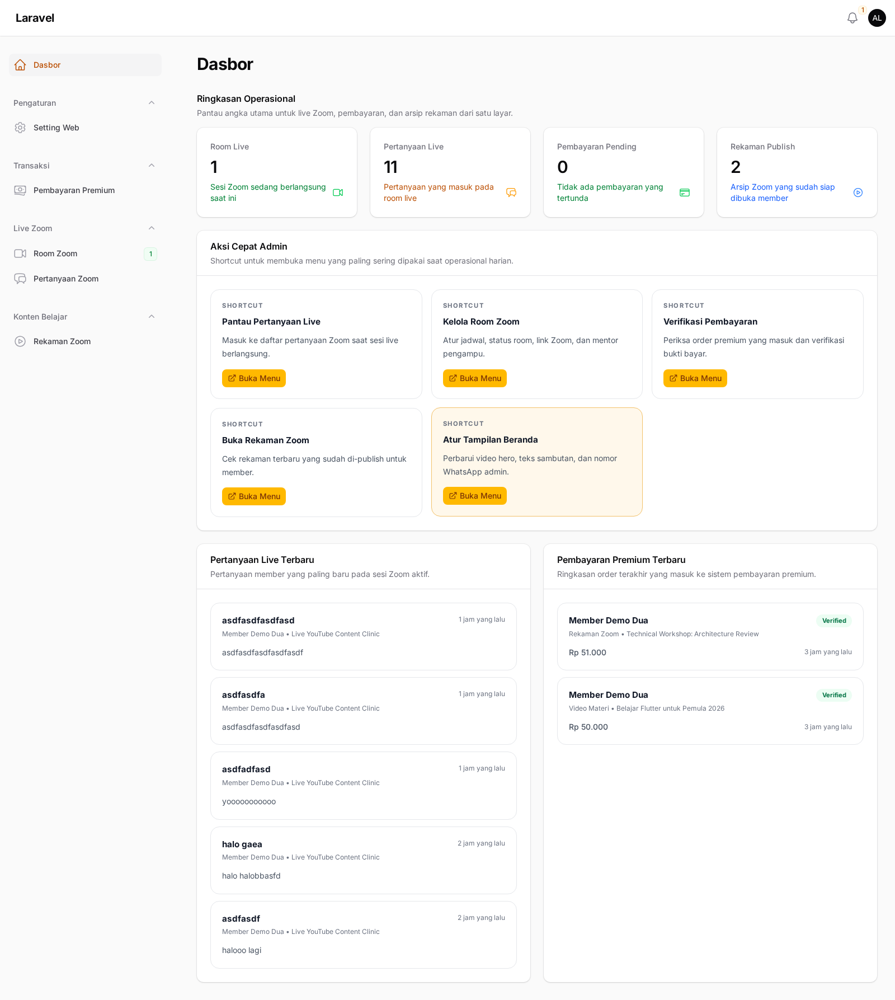
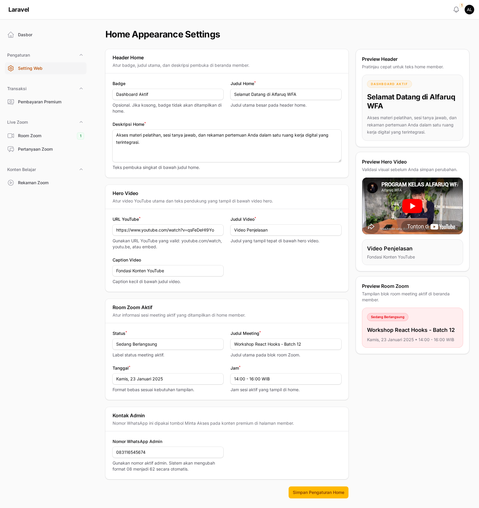
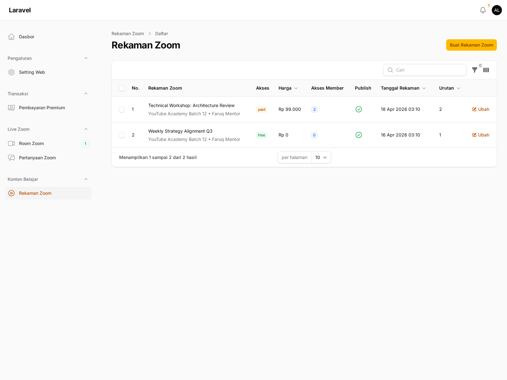
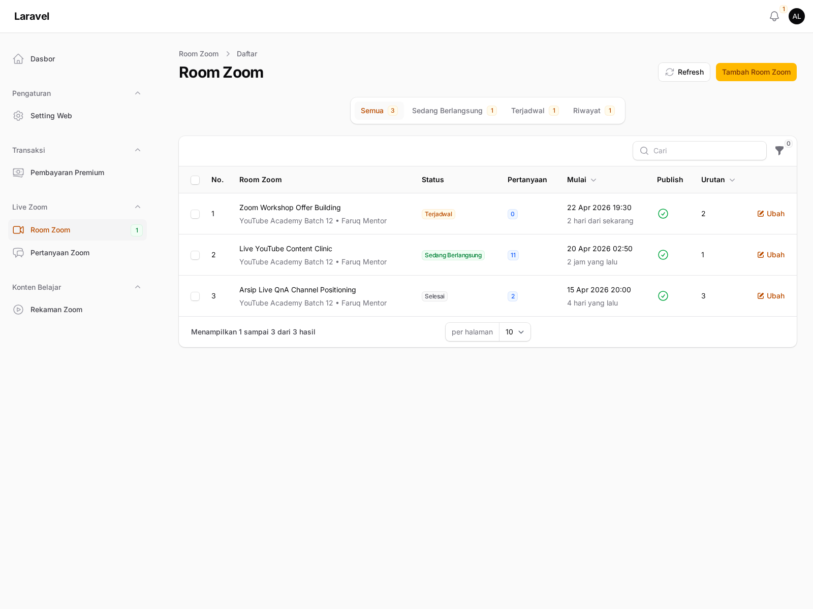
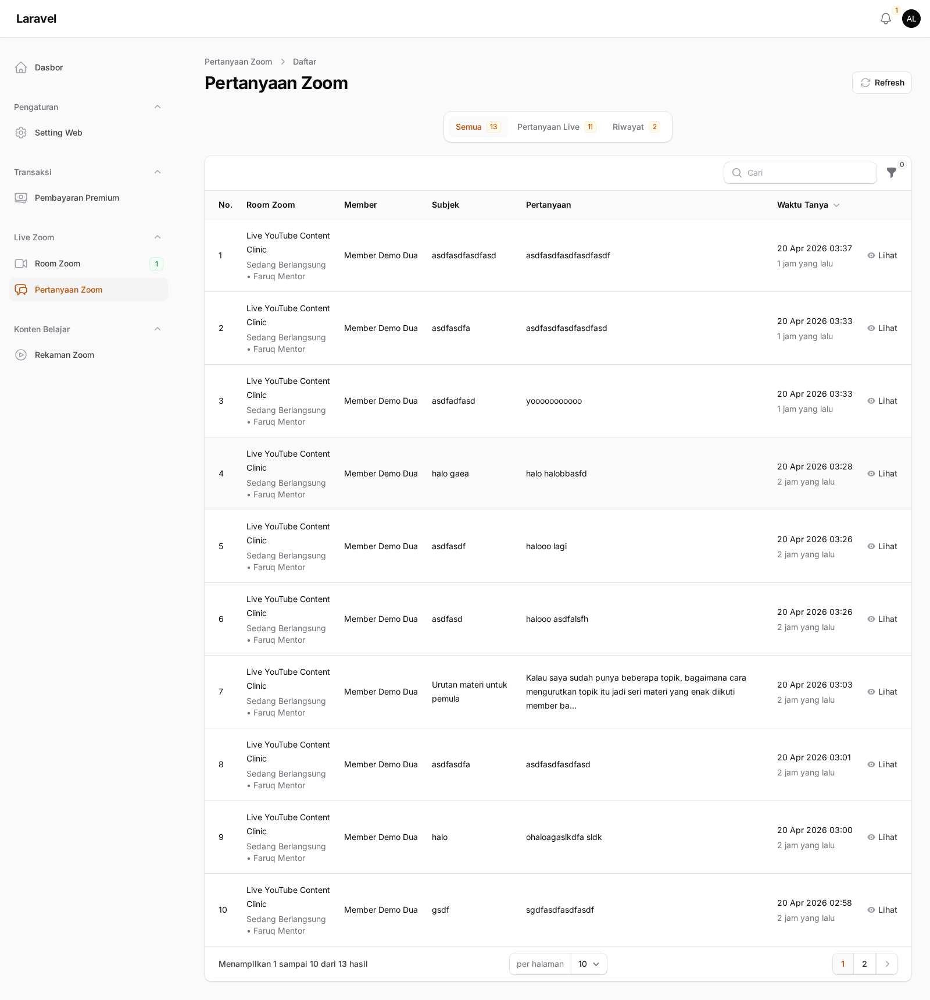
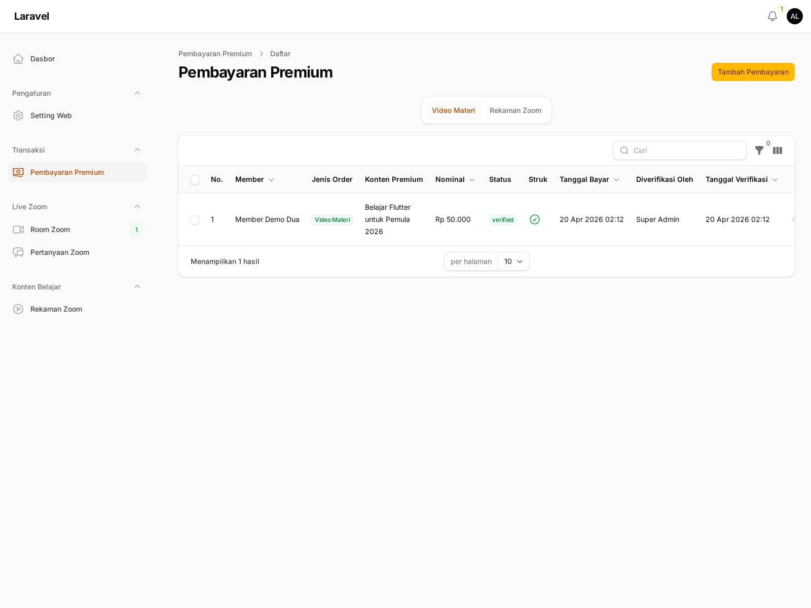

# Panduan Admin Panel

Panduan ini menjelaskan halaman utama admin panel LMS dan alur kerja yang paling sering dipakai saat mengelola konten belajar, sesi live, rekaman Zoom, dan pembayaran premium.

Catatan dokumentasi:

- Hanya halaman yang benar-benar bisa diakses yang dimasukkan ke panduan ini.
- Resource atau halaman yang mengembalikan `403 Forbidden` sengaja tidak di-screenshot dan tidak didokumentasikan.

## Akses Login

- URL: `http://127.0.0.1:8000/login`
- Admin demo:
  - Email: `admin@mail.com`
  - Password: `admin123`

## Dasbor

Dasbor admin dipakai sebagai titik pantau awal. Isi dashboard sekarang difokuskan ke operasional harian LMS, bukan widget bawaan generik.

Komponen utama di dashboard:

- `Ringkasan Operasional` untuk melihat jumlah room live, pertanyaan live, pembayaran pending, dan rekaman yang sudah publish.
- `Aksi Cepat Admin` untuk membuka menu yang paling sering dipakai tanpa klik sidebar berulang, masing-masing lewat tombol `Buka Menu`.
- `Pertanyaan Live Terbaru` untuk memantau pertanyaan baru dari member.
- `Pembayaran Premium Terbaru` untuk memeriksa order terakhir yang masuk.

## Setting Web

Menu `Setting Web` dipakai untuk mengatur tampilan beranda member, video hero, dan kontak admin yang dipakai oleh tombol `Minta Akses` dari sisi member.

## Rekaman Zoom

Menu `Rekaman Zoom` dipakai untuk CRUD arsip video Zoom yang diputar dari YouTube embed. Akses member per rekaman juga dikelola dari resource ini.

## Room Zoom

Menu `Room Zoom` dipakai untuk mengatur sesi live Zoom. Room aktif akan tampil paling atas di sisi member, dan pertanyaan live dikaitkan ke room ini.

Data penting yang biasanya diisi:

- Judul room
- Program atau materi terkait
- Mentor
- Link Zoom
- Meeting ID
- Passcode
- Jadwal mulai
- Status `scheduled`, `live`, atau `finished`

## Pertanyaan Zoom

Menu `Pertanyaan Zoom` dipakai untuk monitoring pertanyaan yang dikirim member saat sesi live berlangsung.

Pemakaian umumnya:

1. Buka halaman ini saat sesi live sedang berjalan.
2. Gunakan tab untuk memisahkan pertanyaan live dan riwayat.
3. Klik aksi `Lihat` pada baris pertanyaan untuk membuka detailnya di modal.
4. Gunakan tombol `Refresh` jika ingin menarik data terbaru secara manual.

## Pembayaran Premium

Menu `Pembayaran Premium` dipakai untuk mencatat order dan verifikasi pembayaran akses premium, baik untuk materi video maupun rekaman Zoom.

Alur kerjanya:

1. Input pembayaran baru dari member.
2. Pilih target pembayaran: materi video atau rekaman Zoom.
3. Verifikasi bukti pembayaran.
4. Saat status diverifikasi, sistem akan membuat akses member ke konten yang dibeli.

## Urutan Kerja Yang Disarankan

Urutan admin yang paling aman untuk operasional harian:

1. Atur `Setting Web`.
2. Atur `Room Zoom` untuk sesi live.
3. Pantau `Pertanyaan Zoom` saat live berlangsung.
4. Arsipkan sesi ke `Rekaman Zoom`.
5. Verifikasi order di `Pembayaran Premium`.

## Catatan Operasional

- Notifikasi pertanyaan Zoom memakai queue database. Pastikan worker berjalan saat ingin memproses notifikasi admin.
- Tautan `Minta Akses` di sisi member mengambil nomor WhatsApp admin dari `Setting Web`.
- Gambar di panduan ini dibuat dari data demo lokal, jadi jumlah item di layar bisa berubah mengikuti isi database aktif.
- Pada audit 20 April 2026, akun `admin@mail.com` hanya memiliki akses ke halaman yang tampil di dokumen ini. Resource yang mengembalikan `403` sengaja dikeluarkan dari panduan.
