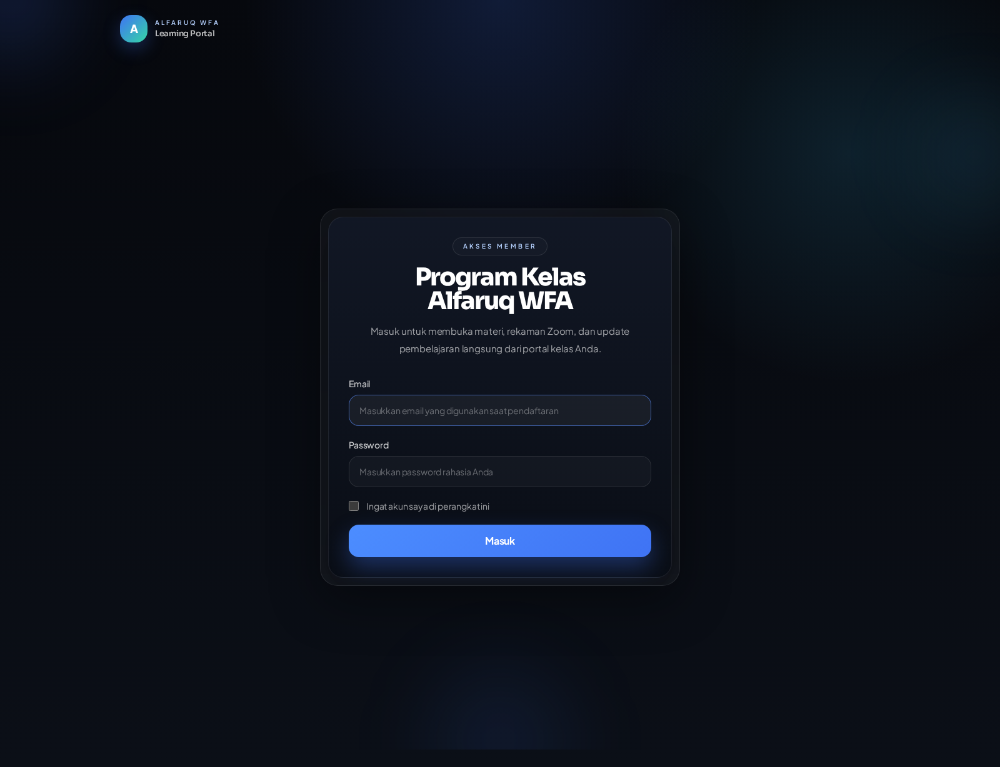
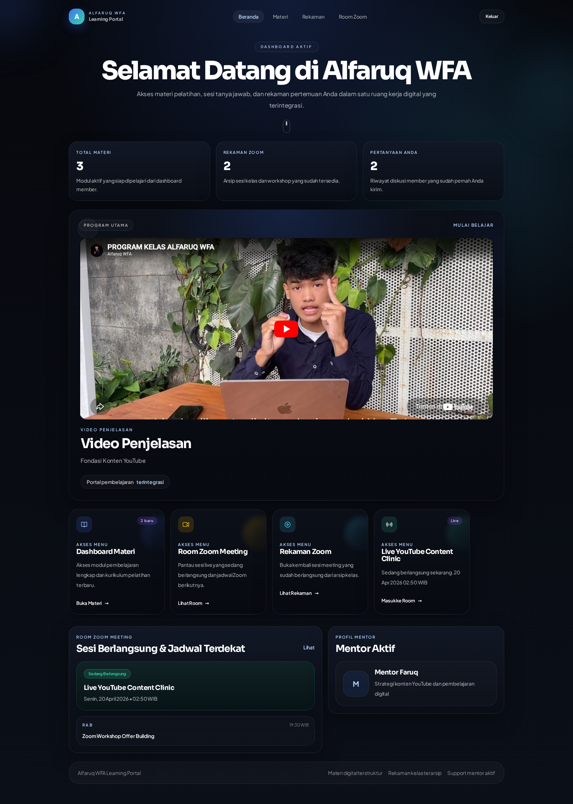
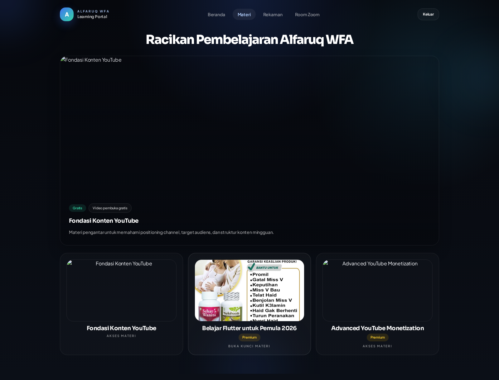
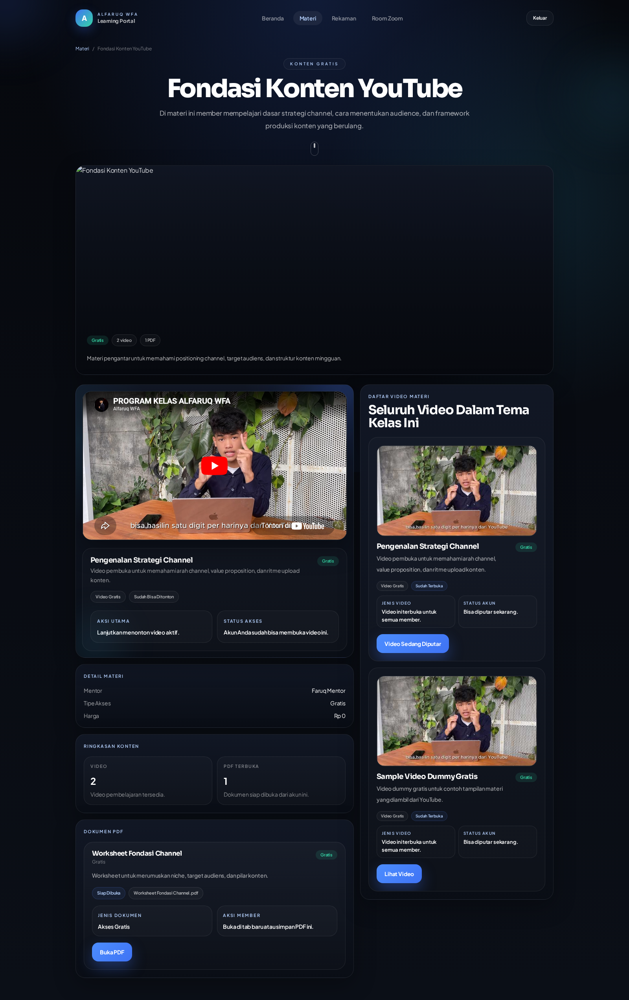
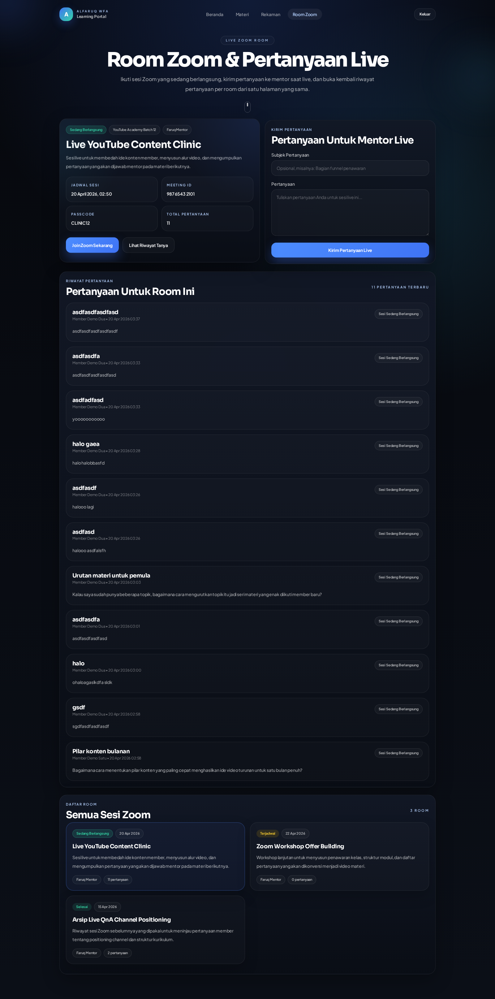
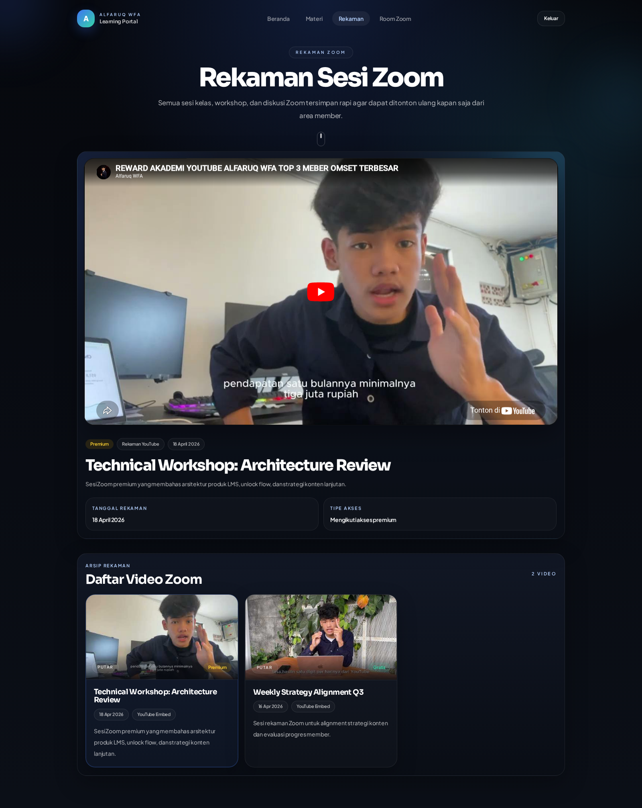

# Panduan Member Portal

Panduan ini menjelaskan halaman utama yang dipakai member untuk belajar, mengikuti Zoom live, dan menonton ulang rekaman.

Catatan dokumentasi:

- Panduan ini hanya memuat halaman yang memang bisa diakses oleh akun member.
- Jika ada halaman yang mengembalikan `403 Forbidden`, halaman tersebut tidak dimasukkan ke dokumentasi maupun screenshot.

## Akses Login

- URL: `http://127.0.0.1:8000/login`
- Member demo:
  - Email: `member1@mail.com`
  - Password: `member123`

## Halaman Login

Member masuk dari halaman login utama. Setelah berhasil login, user member akan diarahkan ke `/home`.

## Beranda

Beranda member adalah pusat navigasi utama. Di halaman ini member bisa melihat video hero, statistik singkat, shortcut menu, room aktif atau jadwal terdekat, dan profil mentor aktif.

Komponen penting di beranda:

- `Dashboard Materi` untuk masuk ke katalog materi.
- `Room Zoom Meeting` untuk membuka sesi live dan form pertanyaan.
- `Rekaman Zoom` untuk menonton ulang arsip Zoom.
- Card keempat yang dinamis untuk menyorot room aktif atau jadwal Zoom berikutnya.

## Materi

Halaman `Materi` menampilkan daftar seluruh materi yang sudah dipublikasikan.

Yang terlihat di halaman ini:

- Hero materi unggulan
- Grid materi
- Badge `Gratis` atau `Premium`
- Tombol aksi untuk membuka materi atau meminta akses

## Detail Materi

Saat member membuka satu materi, halaman detail akan menampilkan video utama, daftar video, PDF, ringkasan akses, dan detail materi.

Perilaku akses:

- Jika video terbuka, YouTube embed dapat diputar langsung.
- Jika video terkunci, member akan melihat state lock dan tombol `Minta Akses`.
- PDF juga tampil di halaman yang sama sesuai hak akses akun.

## Room Zoom

Halaman `Room Zoom` dipakai untuk mengikuti sesi live dan mengirim pertanyaan ke mentor.

Cara kerjanya:

1. Room aktif atau room yang dipilih tampil di panel atas.
2. Tombol `Join Zoom Sekarang` hanya muncul jika status room sedang `live`.
3. Form pertanyaan hanya aktif saat room sedang berlangsung.
4. Riwayat pertanyaan untuk room tersebut tampil di bawah panel utama.
5. Klik card room lain akan memindahkan fokus ke panel utama atas.

## Rekaman Zoom

Halaman `Rekaman Zoom` dipakai untuk menonton ulang arsip sesi Zoom.

Cara kerjanya:

- Pemutar video aktif tampil di bagian atas.
- Daftar rekaman di bawah tampil dalam grid dengan pagination.
- Thumbnail YouTube diambil otomatis dari video yang dipilih.
- Jika rekaman premium belum terbuka, member akan melihat state lock dan tombol `Minta Akses`.

## Alur Member Yang Disarankan

Urutan pemakaian member yang paling natural:

1. Login ke portal.
2. Buka `Beranda` untuk melihat status belajar dan shortcut cepat.
3. Masuk ke `Materi` untuk menonton video pembelajaran.
4. Saat ada sesi live, buka `Room Zoom`.
5. Kirim pertanyaan hanya ketika sesi berstatus `live`.
6. Jika sesi sudah selesai, lanjut buka `Rekaman Zoom` untuk menonton ulang.

## Catatan Akses

- Tombol `Minta Akses` mengarah ke WhatsApp admin yang diatur dari panel admin.
- Room yang sudah selesai tidak lagi menampilkan tombol `Join Zoom Sekarang`.
- Beberapa konten member bersifat premium dan baru terbuka setelah admin memberi akses atau pembayaran diverifikasi.
